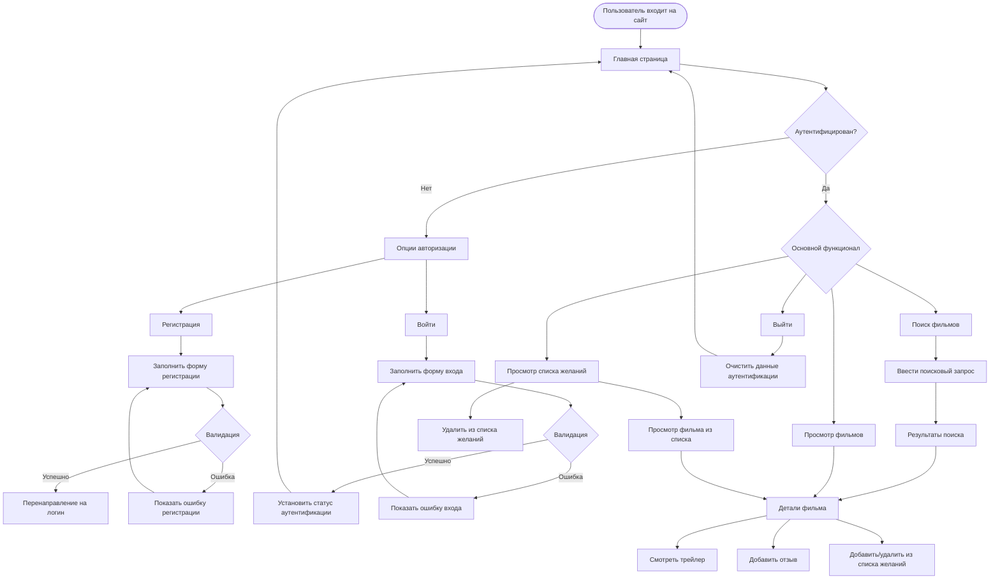

```mermaid
flowchart TD
    Start([Пользователь входит на сайт]) --> HomePage[Главная страница]
    
    %% Аутентификация
    HomePage --> Auth{Аутентифицирован?}
    Auth -->|Нет| AuthOptions[Опции авторизации]
    AuthOptions --> Login[Войти]
    AuthOptions --> Register[Регистрация]
    
    Register --> FillRegForm[Заполнить форму регистрации]
    FillRegForm --> ValidateReg{Валидация}
    ValidateReg -->|Успешно| RedirectLogin[Перенаправление на логин]
    ValidateReg -->|Ошибка| ShowRegError[Показать ошибку регистрации]
    ShowRegError --> FillRegForm
    
    Login --> FillLoginForm[Заполнить форму входа]
    FillLoginForm --> ValidateLogin{Валидация}
    ValidateLogin -->|Успешно| SetAuth[Установить статус аутентификации]
    ValidateLogin -->|Ошибка| ShowLoginError[Показать ошибку входа]
    ShowLoginError --> FillLoginForm
    
    SetAuth --> HomePage
    
    %% Основной функционал
    Auth -->|Да| MainFeatures{Основной функционал}
    
    %% Поиск
    MainFeatures --> Search[Поиск фильмов]
    Search --> EnterQuery[Ввести поисковый запрос]
    EnterQuery --> SearchResults[Результаты поиска]
    SearchResults --> MovieDetails[Детали фильма]
    
    %% Просмотр фильма
    MainFeatures --> BrowseMovies[Просмотр фильмов]
    BrowseMovies --> MovieDetails
    MovieDetails --> ViewTrailer[Смотреть трейлер]
    MovieDetails --> AddReview[Добавить отзыв]
    MovieDetails --> ToggleWishlist[Добавить/удалить из списка желаний]
    
    %% Список желаний
    MainFeatures --> WishlistView[Просмотр списка желаний]
    WishlistView --> RemoveFromWishlist[Удалить из списка желаний]
    WishlistView --> ViewWishlistMovie[Просмотр фильма из списка]
    ViewWishlistMovie --> MovieDetails
    
    %% Выход
    MainFeatures --> Logout[Выйти]
    Logout --> ClearAuth[Очистить данные аутентификации]
    ClearAuth --> HomePage
```